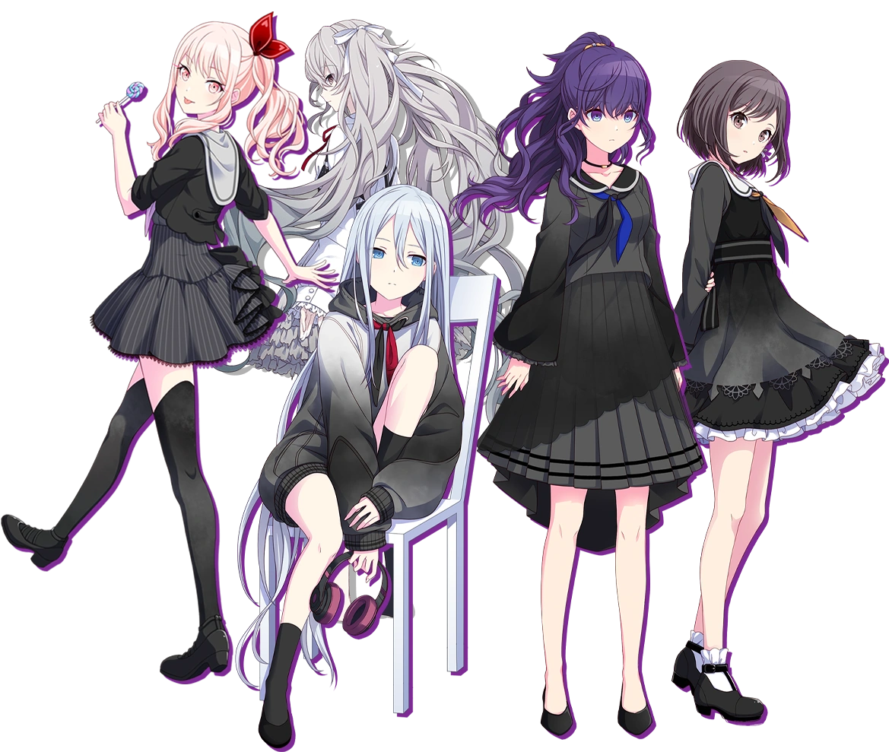

# NightCord-Chat

Este projeto é um simulador de chat desenvolvido como parte da disciplina de **Programação para Internet** no **IFRN campus Santa Cruz**. Ele foi construído utilizando **HTML, CSS e JavaScript**.

---

## Sobre o Chat
Esse é o ambiente de trabalho virtual do grupo musical **NightCord at 25:00**. O sistema permite alternar entre o chat geral e conversas privadas (DMs) entre os membros e o professor.

  
   
  <em>...Precisamos escrever mais músicas...</em>

---

## Como usar
Para testar as diferentes visões e mensagens privadas de cada integrante, utilize as credenciais abaixo:

| Usuário | Senha | Papel |
| :--- | :--- | :--- |
| `mimmarcelo` | `Teste123` | Professor |
| `K` | `2500` | Integrante |
| `Yuki` | `2500` | Integrante |
| `Enanan` | `2500` | Integrante |
| `Amia` | `2500` | Integrante |

---

## Disclaimer
O grupo **NightCord at 25:00** é propriedade da **Sega**. O uso de sua estética e conceitos neste projeto não possui fins lucrativos, sendo utilizado exclusivamente para fins didáticos em ambiente escolar.

---
**Desenvolvido por:** [Jácio Mauê](https://github.com/jacio-m)  
**Professor:** Marcelo Figueiredo Barbosa Júnior
